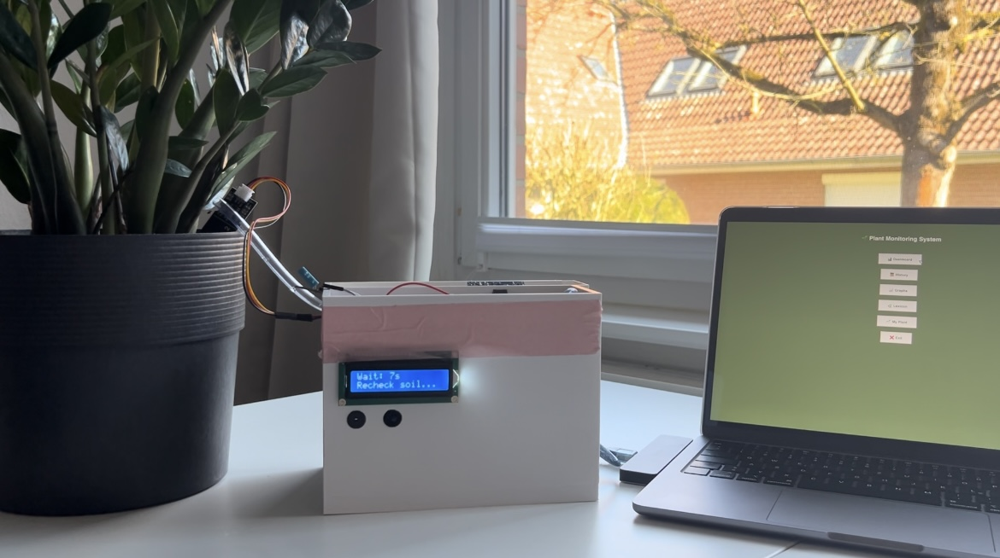

# Flower power - Our plant watering system

### Description 
This project combines an Arduino Uno with sensors and Python software to monitor plant health and automate watering. 
The system measures soil moisture, temperature, and humidity, stores the data, and compares it to optimal ranges for each plant. 
It can generate health reports and alert when conditions require attention, helping maintain healthy plants efficiently.

### [click here for the demo video](https://drive.google.com/file/d/1g_6uH29uKihcayzZ0cg3SZgwNqI0mKgL/view?usp=share_link)

### Our setup 


### How it works 
Our project combines Arduino Uno hardware with software written in the Arduino IDE and Python.
For the plant watering system to function, several components are integrated into the system to measure environmental conditions. 
A temperature and humidity sensor (DHT11) measures the climate of the room, while a soil moisture sensor measures the water content of the soil. These sensors continuously send their readings to the Arduino.
Additional components are used to monitor or notify the user about certain processes. For example, an ultrasonic distance sensor measures the water level in the water container. 
If the water level becomes too low, a LED indicator turns on to alert the user. A buzzer is also used to provide an audible signal when the pump is active.
A key component of the system is the water pump, which is controlled through a relay connected to the Arduino. 
When the soil moisture sensor detects a value below a predefined threshold, the system recognizes that the soil is too dry. The pump is then activated and runs for 5 seconds, watering the plant. 
After this watering cycle, the system waits 30 seconds before checking the soil moisture again. 
This delay prevents overwatering and allows the water to distribute in the soil before the next measurement is taken.
The Arduino Uno acts as the central controller of the hardware system. It runs the program written in the Arduino IDE, reads all sensor values, controls the pump and other components, and displays key information such as temperature, humidity, soil moisture, and water level on an LCD display. 
At the same time, the Arduino sends the sensor readings to the computer through a serial connection.
On the software side, a Python application with a graphical interface receives the data sent by the Arduino. 
This interface displays the live sensor values on a dashboard, allowing the user to monitor the plant’s condition in real time. 
The program also stores the collected data in a database and records daily measurements so that historical data can be viewed later.
In addition to the live monitoring features, the Python interface includes a plant lexicon and plant health analysis tools. 
These rely on external datasets that contain information about plant care requirements and optimal environmental ranges. 
By comparing the measured values with these reference ranges, the system can provide feedback about the plant’s overall health and growing conditions.

### hardware


### components used
- Arduino Board
- Breadboard
- Ultrasonic Sensor
- LED
- Display
- Buzzer
- Humidity and Temperature Sensor (DHT 22)
- Soil Moisture Sensor
- Relay
- 9V Battery
- Water Pump
- Resistor
- Cables

### pins
#### digital pins
1 -> Ultrasonic Sensor Echo <p>
2 -> Ultrasonic Sensor Trig<p>
4 -> LED<p>
5 -> Relay IN<p>
6 -> DHT 22<p>
7 - 12 -> Display<p>
13 -> Buzzer<p>

#### analog pins
A0 -> Soil Moisture Sensor

### File overview 

├── arduinoIDE_code/ -> contains Arduino code <p>
    └── arduino.ino<p>
├── images -> stores the images used for Python GUI or documentation <p>
├── views -> stores python code files for different windows <p>
    └── dashboard.py<p>
    └── graphs.py<p>
    └── history.py<p>
    └── lexicon.py<p>
    └── plant_health.py<p>  
├── documentation -> contains the process of this project <p>
├── README.md -> general project overview <p>
├── app.py -> monitoring plant health <p>
├── main.py -> start application <p>
├── ui_components.py -> UI design <p>
├── plant_care_lexicon.csv -> contains plant-specific information<p>
└── plant_health_ranges.csv -> reference table for optimum state for individual plants <p>


### Libraries

This project uses both Arduino and Python libraries.

### Arduino Libraries
- `LiquidCrystal.h` – for controlling the LCD display
- `DHT.h` – for reading temperature and humidity data from the DHT sensor

### Python Libraries
- `tkinter` – for the graphical user interface
- `sqlite3` – for local database storage
- `threading` – for running background tasks
- `queue` – for thread communication
- `pandas` – for handling and analyzing data
- `json` – for reading and writing JSON data
- `os` – for file and system operations
- `serial` – for communication with Arduino over serial port
- `serial.tools.list_ports` – for detecting available serial ports
- `datetime` – for working with date and time data

The following libraries are part of Python's standard library and require no installation:
tkinter, sqlite3, threading, queue, json, os, datetime

Paste the following segment into your Python Terminal to ensure our code will work within your environment: 
```
pip install pandas
pip install pyserial
```

### Start the interface
Run ui_components.py
Run dashboard.py
Run graphs.py
Run history.py
Run lexicon.py
Run plant_health.py
Run app.py
Run main.py