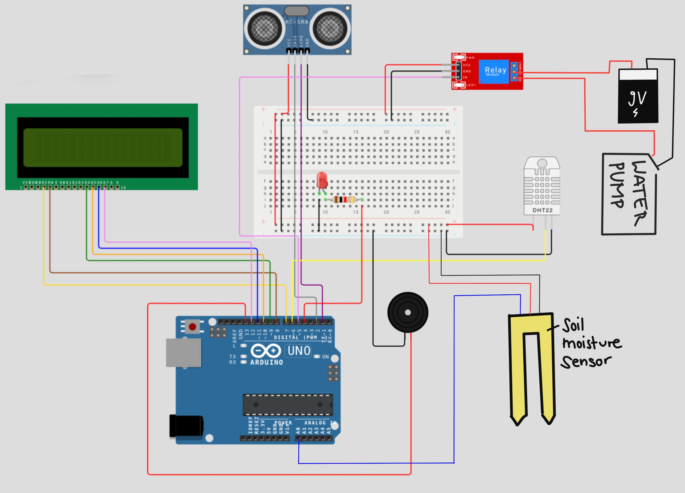

# Flower power - Our plant watering system

### Description 
This project combines an Arduino Uno with sensors and Python software to monitor plant health and automate watering. 
The system measures soil moisture, temperature, and humidity, stores the data, and compares it to optimal ranges for each plant. 
It can generate health reports and alert when conditions require attention, helping maintain healthy plants efficiently.

## hardware


## components used
- Arduino Board
- Breadboard
- Ultrasonic Sensor
- LED
- Display
- Buzzer
- Humidity and Temperature Sensor (DHT 22)
- Soil Moistrue Sensor
- Relay
- 9V Battery
- Water Pump
- Resistor
- Cables

## pins
### digital pins
1 -> Ultrasonic Sensor Echo
2 -> Ultrasonic Sensor Trig
4 -> LED
5 -> Relay IN
6 -> DHT 22
7 - 12 -> Display
13 -> Buzzer

### analog pins
A0 -> Soil Moisture Sensor

## File overview 

├── arduinoIDE_code -> contains Arduino code <p>
├── images -> stores the images used for Python GUI or documentation <p>
├── documentation -> contains the process of this project <p>
├── README.md -> general project overview <p>
├── plant watering system.py -> main Python application <p>
├── plant_care_lexicon.csv -> contains plant-specific information<p>
└── plant_health_ranges.csv -> reference table for optimum state for individual plants <p>


## Libraries

This project uses both Arduino and Python libraries.

### Arduino Libraries
- `LiquidCrystal.h` – for controlling the LCD display
- `DHT.h` – for reading temperature and humidity data from the DHT sensor

### Python Libraries
- `tkinter` – for the graphical user interface
- `sqlite3` – for local database storage
- `threading` – for running background tasks
- `queue` – for thread communication
- `pandas` – for handling and analyzing data
- `json` – for reading and writing JSON data
- `os` – for file and system operations
- `serial` – for communication with Arduino over serial port
- `serial.tools.list_ports` – for detecting available serial ports
- `datetime` – for working with date and time data

The following libraries are part of Python's standard library and require no installation:
tkinter, sqlite3, threading, queue, json, os, datetime

Paste the following segment into your Python Terminal to ensure our code will work within your environment: 
```
pip install pandas
pip install pyserial
```

## Start the interface
Run `plant_watering_system.py`
