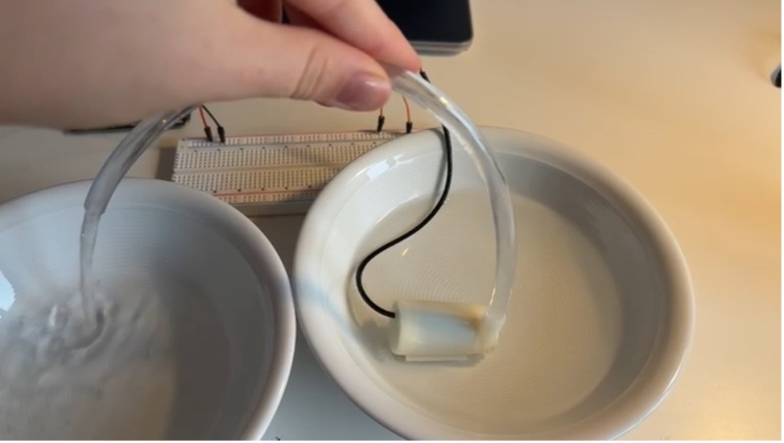

## plant_watering_system
### 16.11.2025
https://projecthub.arduino.cc/ksoderby/smart-plant-watering-with-arduino-iot-cloud-0dff1f
-	To get understanding of what's necessary 
-	First problem – relay doesn’t fit correctly in the breadboard 
  -	Question: should we consider Arduino Cloud app for our project? 
    - Depends – she knows very little 
    - Python more reliable 
  - How to connect water pump (thin cables) to relay and GND 
    - screwable terminals 
    - pay attention about pitch 
    - solder – take some wire – digital lab soldering iron – solder wire to one side of this – to make a connection 
  - Do we need a relay module – doesn’t fit breadboard 
  - Moisture sensor – highest was 87% and lowest 56% - even though 
  - Generally our circuit – is this correct with the power supply being external? 
    - More stable if its on the breadboard 
    - 9V battery not really good doesn’t hold that long 
    - Can also try powering it through USB cable 
        •	Plugged supply more reliable 
        •	Make sure its 5V 
        •	Or through the thing we use for battery – PLUG can then be changed manually on 

### 19.11.2025 
-	After being told we could either use screwable terminals or soldering to make the connection beweeen the thin wires and the 5V or GND pin possible to ensure that our pump would be able to run we decided to solder as the other products would have been expensive considering we only needed one or two screwable terminals 
-	Paula watched this video (https://www.youtube.com/watch?v=uj_PbRBirkQ) to get an idea of how to solder: 
-	In the next step she used a cutter knife to cut a wire in half and remove the isolation. The hardest part was to connect the two cables and twist the two wires together since both were fragile and very thin. However, once twisted together it was quite easy to solder them together with solder wire.
-	This was done with the minus and plus pole and once plugged in the pump finally worked and made noises  -> pumping the water of one bowl into the other one 

-	Moreover, as we had problems with connecting the relay to the breadboard we consulted some further reading and realised that our only option would be to manually bend the “feet” of the relay or order a relay module which was prominent throughout multiple videos and project pitches that conducted similar projects 
-	In preperation for our idea to create a python user interface for our plant project Frieda watched the following video: https://www.youtube.com/watch?v=UeybhVFqoeg – and tried to follow the basic instructions to get an idea of what will be necessary and what we should consider when implementing our actual idea 
    - Now know that for our project when using python its important to manually connect the port the Arduino is plugged in to Python to ensure that Python knows which port should be used – to know which port see Arduino IDE – Tools – port and copy dev name 
	- Also in this case the person from the video used: # pip install pyserial to make it all work 
	- For the actual turning on or off of the LED it was important to have a short code in the Arduino IDE that made the pins either high or low depending on the input – this way when I typed in ON in the Terminal on python it actually turned on the green led 
	- Sadly the red pin and its commands didn’t work but for me in that moment it was enough to gain a better understanding of using Arduino IDE and Python together 

