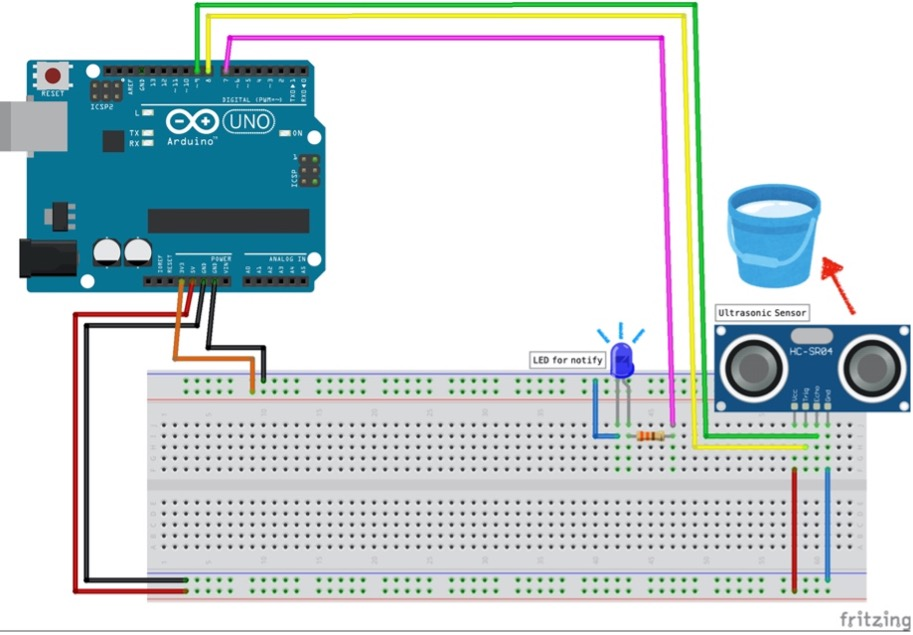

## plant_watering_system
### 16.11.2025
https://projecthub.arduino.cc/ksoderby/smart-plant-watering-with-arduino-iot-cloud-0dff1f
-	To get understanding of what's necessary 
-	First problem – relay doesn’t fit correctly in the breadboard 
  -	Question: should we consider Arduino Cloud app for our project? 
    - Depends – she knows very little 
    - Python more reliable 
  - How to connect water pump (thin cables) to relay and GND 
    - screwable terminals 
    - pay attention about pitch 
    - solder – take some wire – digital lab soldering iron – solder wire to one side of this – to make a connection 
  - Do we need a relay module – doesn’t fit breadboard 
  - Moisture sensor – highest was 87% and lowest 56% - even though 
  - Generally our circuit – is this correct with the power supply being external? 
    - More stable if its on the breadboard 
    - 9V battery not really good doesn’t hold that long 
    - Can also try powering it through USB cable 
        •	Plugged supply more reliable 
        •	Make sure its 5V 
        •	Or through the thing we use for battery – PLUG can then be changed manually on 

### 19.11.2025 
-	After being told we could either use screwable terminals or soldering to make the connection beweeen the thin wires and the 5V or GND pin possible to ensure that our pump would be able to run we decided to solder as the other products would have been expensive considering we only needed one or two screwable terminals 
-	Paula watched this video (https://www.youtube.com/watch?v=uj_PbRBirkQ) to get an idea of how to solder: 
-	In the next step she used a cutter knife to cut a wire in half and remove the isolation. The hardest part was to connect the two cables and twist the two wires together since both were fragile and very thin. However, once twisted together it was quite easy to solder them together with solder wire.
-	This was done with the minus and plus pole and once plugged in the pump finally worked and made noises  -> pumping the water of one bowl into the other one 

-	Moreover, as we had problems with connecting the relay to the breadboard we consulted some further reading and realised that our only option would be to manually bend the “feet” of the relay or order a relay module which was prominent throughout multiple videos and project pitches that conducted similar projects 
-	In preperation for our idea to create a python user interface for our plant project Frieda watched the following video: https://www.youtube.com/watch?v=UeybhVFqoeg – and tried to follow the basic instructions to get an idea of what will be necessary and what we should consider when implementing our actual idea 
    - Now know that for our project when using python its important to manually connect the port the Arduino is plugged in to Python to ensure that Python knows which port should be used – to know which port see Arduino IDE – Tools – port and copy dev name 
	- Also in this case the person from the video used: # pip install pyserial to make it all work 
	- For the actual turning on or off of the LED it was important to have a short code in the Arduino IDE that made the pins either high or low depending on the input – this way when I typed in ON in the Terminal on python it actually turned on the green led 
	- Sadly the red pin and its commands didn’t work but for me in that moment it was enough to gain a better understanding of using Arduino IDE and Python together 

### 21.11.2025 
-	sadly the relay module which we ordered didn’t arrive on time so today we tried the pump and the rest of the project without using the relay 
-	beforehand we tried bending the “legs” of the relay once again but it didn’t work 
-	we discussed potentially using the remote control or touch sensor 
-	additionally when looking up similar projects this idea catched our eye: https://projecthub.arduino.cc/lc_lab/automatic-watering-system-for-my-plants-e4c4b9 
-	we would also like to incorporate the monitor (5V 1602A Module), buzzer as well as the ultrasonic distance sensor
    - the buzzer could play a melody when the soil is too dry and the distance sensor could come in handy to measure the water level of the cup the water is in
-   somehow the pump seemed to work when we inserted it into the breadboards side (+ and -) – then we realized that just putting the + cable of the pump into pin 3 -> Is only for signal but not for actually powering the pump 
-	pump in GND (- line which is connected to GND) and the + wire of the pump Is in the same line as the wire from pin 3 – which is the sensor for the pump? – for the pump to be turned on or off depending on the soil moisture 
-	then suddenly pump wasn’t strong enough – have to think of a better external power supply to ensure the pump has enough power 
-	other than that technically the setup worked – when the soil moisture sensor was dry water was pumped and when it was wet the pump stopped 
-	additionally the buzzer played Pirates of the Caribbean as soon as the soil moisture detected no moisture? Or less moisture? 
-	the Serial monitor showed: …. 
- #### code we used in this case & for this specific setup see WORD 
-   We discussed that for our next meeting we would look up further additions for our setup and how to implement them – so that next time – when the relay module can be used and we have a solution for our external power source (can’t keep using the battery or the + and – of our breadboard) we can implement everything we have planed 
-	Additionally, we want to use Python for our user interface – so as soon as the “basics” of the physical part (Arduino…) are finalized we want to add the major part of the software part of our project 

### 22.11.2025 
- Frieda thought about further additions for our setup: 
  - Water Level Sensor: Detect if the reservoir is empty to prevent pump burnout
    - As soon as the water level reaches below a certain number an LED on the board should turn on and a notification should be in the Python interface:
       (images/water_distance_sensor_setup.jpg)
  - Variable Watering: Instead of just ON/OFF, calculate the amount of water needed based on soil dryness, plant type, and ambient temperature.
    - Using temperature-humidity sensor?
    - https://letplant.com/insights/indoor-houseplants/ - different plant types and their needs 
    - add code so that instead of keeping the pump ON continuously, you can: 
    •	run pump for 5 seconds or so 
    •	pause 1 min 
    •	recheck soil (to prevent flooding) 
  - Trend Analysis:  to see how the plant’s environment changes.
  - Animated LED Effects: Instead of just static colors, use patterns to show the plant’s “mood” (slow breathing effect = healthy, blinking = thirsty).
  - screen
  - meanwhile Paula occupied herself with a possible container for our project as we didn't want to have that many cables flying around - she started researching 3D printing and we thought about printing it in the Digi Lab 

### 24.11.2025
-	As we conducted this meeting in the KLIPPO we decided to not incorporate the buzzer 
-	Sadly, no new idea for the external power source 
-	Somehow the relay module made a weird clicking sound and a red LED went blinking for a short time when running the code 
-	Somehow the serial monitor created weird values when the soil monitor was put in water -> we have to fix the calculation so that the pump actually turns off when the soil moisture is enough -> realized that when putting the soil moisture sensor in wrong (not headfirst and straight) the values don’t make that much sense 
-   Added this logic into our code: 
  - add code so that instead of keeping the pump ON continuously, you can: 
    - run pump for 5 seconds or so 
    - pause 1 min 
    - recheck soil (to prevent flooding) 
-   in the next step we added the Ultrasonic sensor to measure the distance in our bowl of water additionally we added a blue LED on the breadboard which is supposed to blink when the water levels are too low 
  - somehow the Serial monitor detected the correct things yet the blue LED didn’t follow this pattern 
  - realized that it only updated the water level value every minute – had to create a code where the water level is being overlooked simultaneously 
  - now it all worked accordingly 
-   tried to add the LED screen yet seemed pretty complicated as multiple wires are necessary and other sources seemed to use additional components to make the connection easier 
-	tried it out despite that – installed LiquidCrystal_I2C.h 
  - it lit up a bit yet nothing else happened - we weren't sure if we had gotten the connections right - so we wrote that question down for the next time we had class 

### 28.11.2025 
- we started by putting up the small LED to see if it works - we used the following tutorial: https://docs.arduino.cc/learn/electronics/lcd-displays/
- the screen finally lit up and then we changed our Arduino IDE code to actually print something on the screen 
- meanwhile Frieda tested out a possible code on Python to see if the interface worked and the code ran correctly with no problems - when combining Python with Arduino it is important to mention in your Python code which port your Arduino board is plugged into 
- Furthermore, we brainstormed what further additions could be implemented 
  - we thought about adding a tiny plant lexicon on our python interface so that users could look up typical plants and what further type of care is possible 
  - moreover, we want to add a graph which basically represents how the plant the Arduino is "connected to" is doing 
- currently our setup looked like this:
 
- LED screen worked and printed the temperature, soil moisture and humidity as well as if the pump is on yet the temperature, soil moisture and humidity didn't show any or non correct numbers 
- we then found out that we hadn't connected the digital pin correctly to the sensor (https://projecthub.arduino.cc/rudraksh2008/temperature-and-humidity-sensor-with-arduino-1d52a6) - after that we got correct numbers 

- next we added our distance measure sensor and started to setup the whole setup with water and so on to test it out 
- but the pump didn't work - we checked the cables but everything seemed to be wired correctly 

### 30.11.2025 
- today Frieda started to implement a plant dictionary 
- for this she researched on the matter and found this pre defined excel sheet on reddit - https://docs.google.com/spreadsheets/d/1RArYadwipMGp9QFCYqbUTmwvCPyvwURWf7hIABg2n14/edit?gid=0#gid=0
- she then proceeded to turn it into a csv to make it compatible with Python 
- then she added it into the GUI and called it in the plant watering systems interface python code 
- from there she got inspired by our previous code from Tech Basics I - scrollbar, buttons and so on 
- additionally she changed the basic idea by adding a class and started to use tk and so on to ensure a nice and simple interface with matching colors 
- sadly the lexicon interfaces' screen width and height doesn't match what it would actually need - we are searching for a solution for this problem 

- Paula in the meantime completed the Arduino watering system. 
- Added all the gadgets and made them work all together
  - for the Code: During initialization, the program sets up hardware interfaces for the serial monitor, LCD display, sensors, and outputs, and displays a welcome message. In the main loop, the system continuously reads sensor values for soil moisture, temperature, humidity, and water tank level. If the DHT sensor fails, error handling routines display an error message and skip the watering cycle. The water tank level is checked via an ultrasonic sensor, activating an LED indicator if the water is low. Using the soil moisture reading, the system compares it against a preset threshold to decide when to run the pump. If watering occurs, the relay triggers the pump for 5 seconds and the system waits 30 seconds before proceeding. Throughout, real-time data and system status are shown on the LCD, and details of each cycle are logged to the serial output for debugging. Helper functions are used to convert the soil sensor’s raw values into percentages and to calculate water level distances from the ultrasonic sensor’s readings.
- For this she used several sources (https://docs.arduino.cc/learn/electronics/lcd-displays/, https://projecthub.arduino.cc/lc_lab/automatic-watering-system-for-my-plants-e4c4b9, https://www.youtube.com/watch?v=w8Gyti0fwqI)
- The most complicated thing was to get used to working in C++ with the Display and the Libray LiquidCrystal
### 1.12.2025
- tried to 3D print our model in the Digi Lab however we decided against it after we saw the printing time
- 
- , 

### 05.12.2025
- Frieda changed the show_graphs to use plant_data.json to check if actual data can be printed 
- we aren't sure jet if we should keep it this way or try out more with matbpilot?
- additionally we are thinking about adding a graph were all these components come together or where you get info what your graphs say about your plant health (maybe by comparing it with data from lexicon?)
- moreover, Frieda added a "necessary_libraries" as this was something that could have been improved in our project from last semester - so that the person knows which libraries are necessary for this project to work

### 07.12.2025
- We firstly thought we weren't able to print the 3d container however Paulas friend who studies at TUHH offered Paula to use their §D Printing facilities.
- Together with the friend, who had more experience than Paula in 3D printing, helped her to optimize her model.
- costs and effort were saved, and we printed it with a filament thickness of 5%.

### 14.12.2025 
- becuase the walls of the 3d container were a bit too thin, Paula decided to fill the inside of the water container with epoxy resin to make it waterproof. 
- 

### 16.12.2025
- Today we had our presentation to pitch our current project idea and what we have so far 
- these were the bullet points we gathered after getting a review & tips: 
  - Shouldn’t add more just iteration 
  - Making everything stable 
  - Probably problems with the wires – adjust 
  - Caliberation button??? 
  - Categorizing plants – more tropical and then having the watering accordingly 
  - Don’t recommend using battery – especially with LCDisplay

### 19.12.2025
- Today Frieda looked into the possibilities of letting the user get a health report based on inserting the actual plant and the program then comparing the data of the daily readings with those of the lexicon
- the problem is that the lexicon currently has more written words for the points that would be important - obvioulsy Python would simple need numbers or a range of numbers to detect the health of the plant based on knowing whats a good range and what is out of that range 
- we are thinking about either changing the lexicon or creating a further file which runs in the back based solely on numbers for the ideal humidity and temperature of the plant 