# Documentation

## sketches 
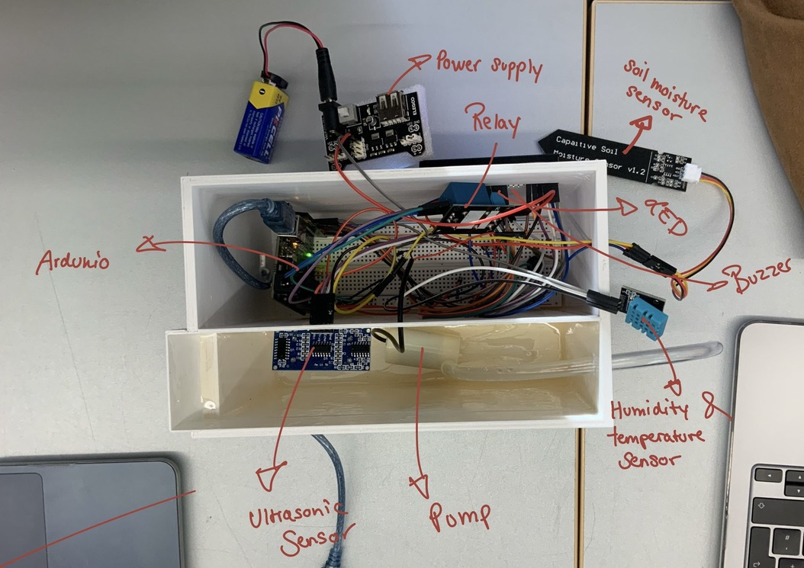
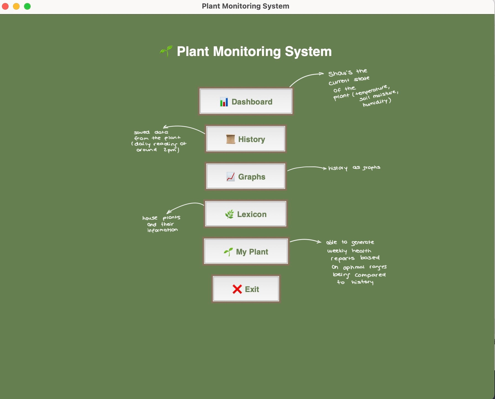

### 3D container: 
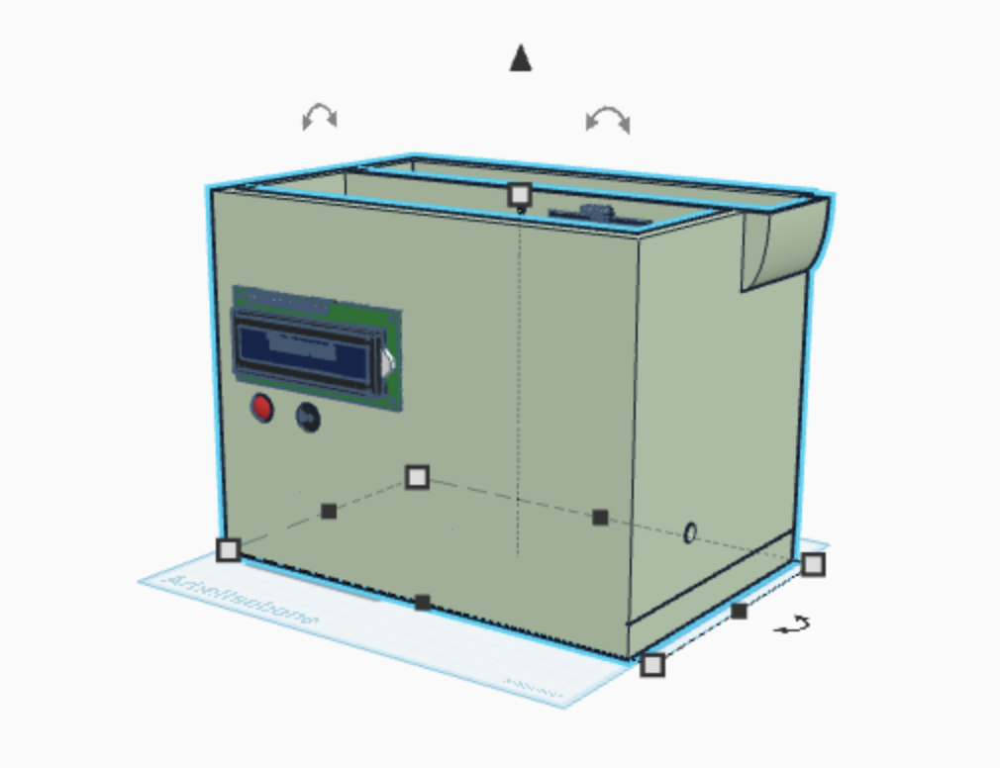
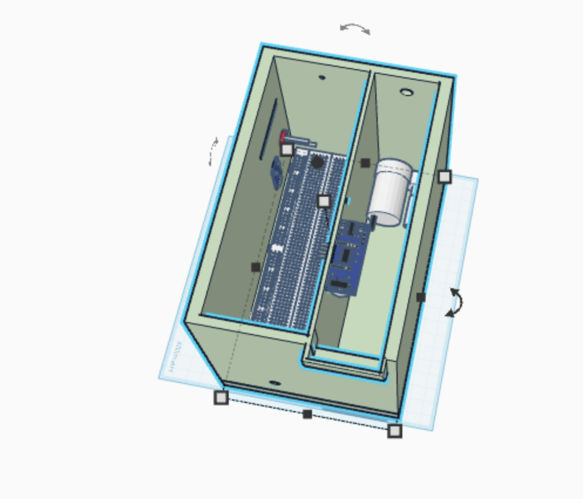

## Hardware setup 

## circuit diagram 

## Meetings 
### 16.11.2025 
Before this meeting we had looked at similar project examples (https://projecthub.arduino.cc/ksoderby/smart-plant-watering-with-arduino-iot-cloud-0dff1f) to gain a better understanding of what would be necessary for our own project.
One of the first problems we encountered was that the relay did not fit properly into the breadboard. 

Furthermore,  we encountered more problems and questions which is why we asked Qianxun Chen for guidance.
We also asked whether it would make sense to use the Arduino Cloud app for our project. However, since we had very little experience with this tool, we were advised that using Python for the interface and communication could be a more reliable and manageable solution for us.
Another important topic was how to connect the very thin cables of the water pump to the relay and the GND pin. 
We learned that this could either be done using screwable terminals or by soldering additional wires to the pump cables to create a stable connection. 
If soldering was used, we could attach a thicker wire to the thin cable using the soldering iron available in the Digital Lab. 
When using screwable terminals, we were also told to pay attention to the pitch so that the components fit properly.

We further discussed whether a relay module would be necessary, especially since the relay we had did not fit well on the breadboard. 
While testing the soil moisture sensor, we also noticed that the measured values ranged only between about 56% and 87%, even though the actual soil conditions seemed to vary more significantly. 
This helped us understand that sensor readings might require calibration or careful interpretation.

Furthermore, we discussed whether our circuit was correct, particularly since we were using an external power supply. We concluded that the circuit would likely be more stable if powered through the breadboard. 
Using a 9V battery was not ideal because it would not last very long. 
Alternatively, the system could be powered through a USB cable, which would provide a more reliable power supply as long as it delivers 5V. 
Another option would be using the battery plug we had, which could also be manually switched on when needed.

### 19.11.2025 
After being advised that we could either use screwable terminals or soldering to connect the thin pump wires to the 5V and GND pins, we decided to solder the cables. 
Purchasing screwable terminals would have been unnecessarily expensive considering we only needed one or two of them.

To learn how to solder, Paula watched the following video tutorial https://www.youtube.com/watch?v=uj_PbRBirkQ. 
Afterward, she used a cutter knife to cut a wire in half and remove the insulation. The most difficult part was connecting the two very thin and fragile wires and twisting them together. 
However, once they were properly twisted, soldering them together with solder wire was relatively easy.

This process was repeated for both the minus and plus poles. 
After connecting everything, the pump finally worked and started pumping water from one bowl into another.
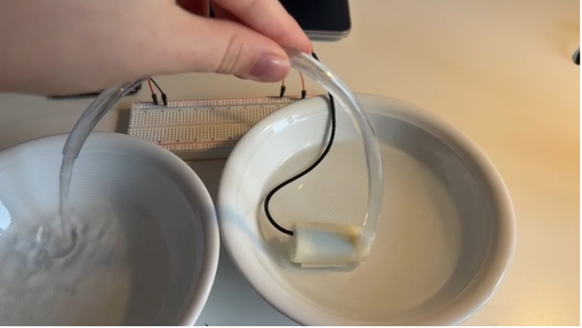

Additionally, we continued investigating the issue with the relay not fitting into the breadboard. 
After consulting further sources, we realized that our only options were either to manually bend the relay’s pins or to order a relay module, which was commonly used in similar projects shown in videos and tutorials.

In preparation for building a Python user interface for the plant watering system, Frieda watched the following tutorial: https://www.youtube.com/watch?v=UeybhVFqoeg. 
She followed the basic instructions to better understand how Python can communicate with Arduino. One important step was manually connecting the Arduino port in Python so that Python knows which port to use. 
This port can be found in the Arduino IDE under Tools → Port, where the device name can be copied.
The tutorial also required installing the pyserial library using pip install pyserial. 
For controlling components such as LEDs, a short Arduino code was necessary that sets pins to HIGH or LOW depending on the input received from Python. This way, typing “ON” in the Python terminal successfully turned on the green LED. 
The red LED commands did not work correctly, but the experiment was still useful for gaining a better understanding of how Arduino and Python interact.

### 21.11.2025 
Unfortunately, the relay module we ordered had not arrived yet, so during this meeting we tested the pump and the rest of the setup without using the relay. Before doing so, we once again tried bending the relay’s pins to fit it into the breadboard, but this still did not work.
We briefly discussed other possible interaction methods, such as using a remote control or a touch sensor. While researching similar projects, we also found the following example which inspired us: https://projecthub.arduino.cc/lc_lab/automatic-watering-system-for-my-plants-e4c4b9.

Based on this idea, we considered adding additional components to our system, such as a 5V 1602A display module, a buzzer, and an ultrasonic distance sensor. The buzzer could play a melody when the soil becomes too dry, while the ultrasonic sensor could measure the water level in the container.
During testing, the pump initially seemed to work when we inserted it into the breadboard’s side power rails. We then realized that connecting the pump’s positive cable to pin 3 alone would not power it, because that pin only provides a signal and not the actual power needed for the pump. 
The correct setup was to connect the pump’s negative wire to the GND line and the positive wire to the same line as the wire from pin 3, which acted as the control signal.

However, the pump later appeared too weak, which indicated that we needed a better external power supply to ensure it received enough power. Apart from that issue, the system worked technically: when the soil moisture sensor detected dry soil, the pump started pumping water, and when the soil was wet enough, the pump stopped.
Additionally, the buzzer played the melody from Pirates of the Caribbean whenever the soil moisture sensor detected that the soil was too dry. The serial monitor also displayed sensor values and system information.
For the next meeting, we decided to research additional features and how to implement them so that we could integrate everything once the relay module arrived and we found a reliable external power supply. 
We also planned to focus more on the Python user interface once the physical Arduino setup was finalized.

### 22.11.2025 
During this meeting, Frieda focused on brainstorming further additions to our setup. One idea was to implement a water level sensor that detects when the water reservoir is empty in order to prevent the pump from running dry and potentially burning out. 
When the water level drops below a certain threshold, an LED on the board should turn on and a notification should appear in the Python interface.
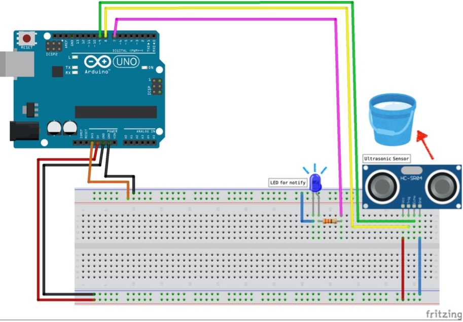 

Another idea was variable watering. Instead of simply switching the pump on or off, the system could calculate how much water the plant needs based on factors such as soil dryness, plant type, and ambient temperature. 
For this purpose, we considered adding a temperature-humidity sensor. 
We also researched plant requirements using resources such as https://letplant.com/insights/indoor-houseplants/. 

To avoid flooding the plant, we discussed modifying the code so that the pump would run for a short time (for example 5 seconds), pause for one minute, and then recheck the soil moisture before watering again.
We also considered implementing trend analysis, which would allow users to observe how environmental conditions change over time. 
Another possible feature involved animated LED effects to display the plant’s “mood,” such as a slow breathing effect when the plant is healthy or blinking lights when it needs water. 
We also wanted to incorporate a screen to display information directly on the device.

Meanwhile, Paula started looking for a suitable container for the project because we wanted to avoid having too many exposed cables. 
She began researching 3D printing options, and we considered printing a case in the Digital Lab.

### 24.11.2025
Since this meeting took place in the KLIPPO workspace, we decided not to include the buzzer in the final setup. 
We still had not found a new solution for the external power supply. We thought about just keeping the current battery from our Arduino kit. 

When testing the relay module, we noticed that it produced a clicking sound and that a red LED briefly blinked when running the code. 
Additionally, the serial monitor sometimes showed strange values when the soil moisture sensor was placed in water. 
We realized that the calculation in our code needed to be corrected so that the pump would actually stop when the soil moisture was sufficient. 

We also discovered that incorrect sensor placement (not straight or not inserted properly) resulted in unreliable readings.
We then implemented a watering logic where the pump runs for 5 seconds, pauses for one minute, and then checks the soil moisture again to prevent overwatering.

Next, we added the ultrasonic distance sensor to measure the water level in the container and connected a blue LED that should blink when the water level becomes too low. 
Initially, the serial monitor detected the correct values but the LED did not behave accordingly. 
We realized that the water level was only being updated once per minute, so we modified the code to monitor the water level continuously. 
After this change, the system worked as intended.

We also attempted to add the LED screen, but the setup was complicated because many wires were required and some tutorials used additional components to simplify the connection. 
Despite this, we tried installing the LiquidCrystal_I2C library and connecting the display. 
The screen lit up slightly, but nothing else happened. Since we were unsure whether the wiring was correct, we wrote down the issue to ask about it in the next class.

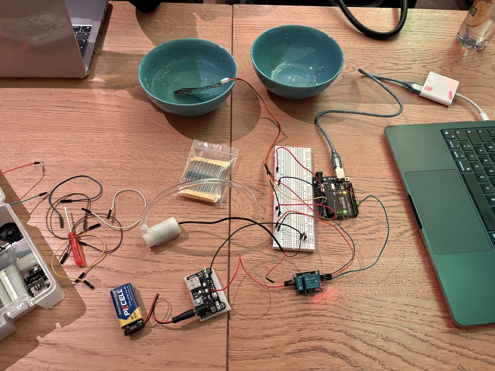
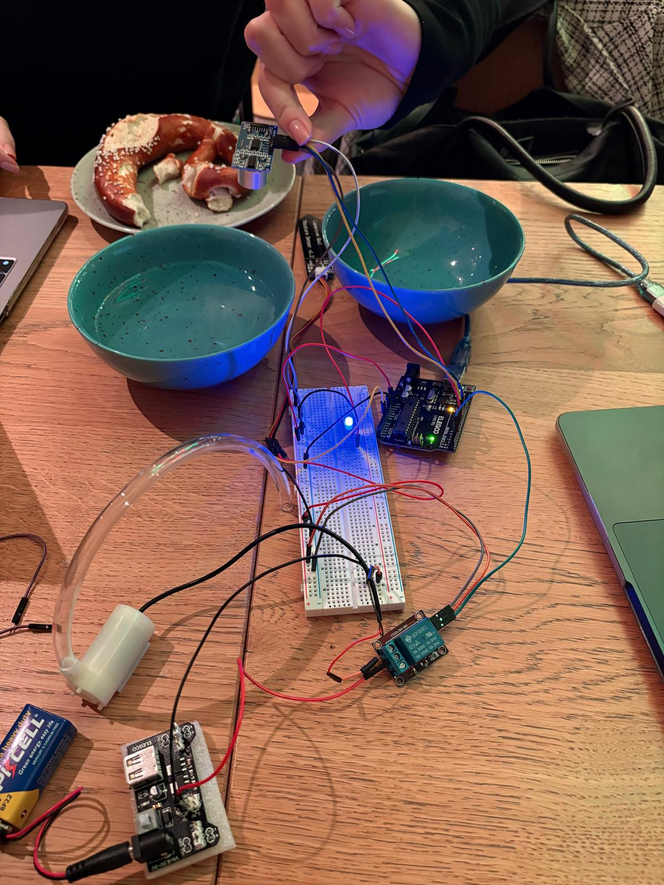
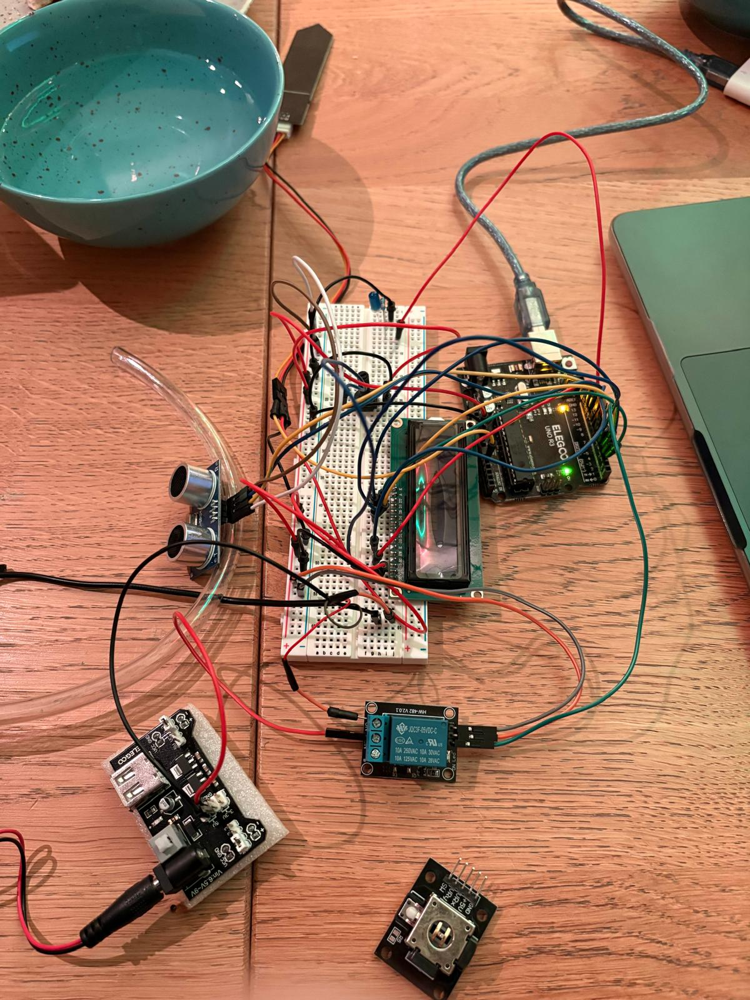
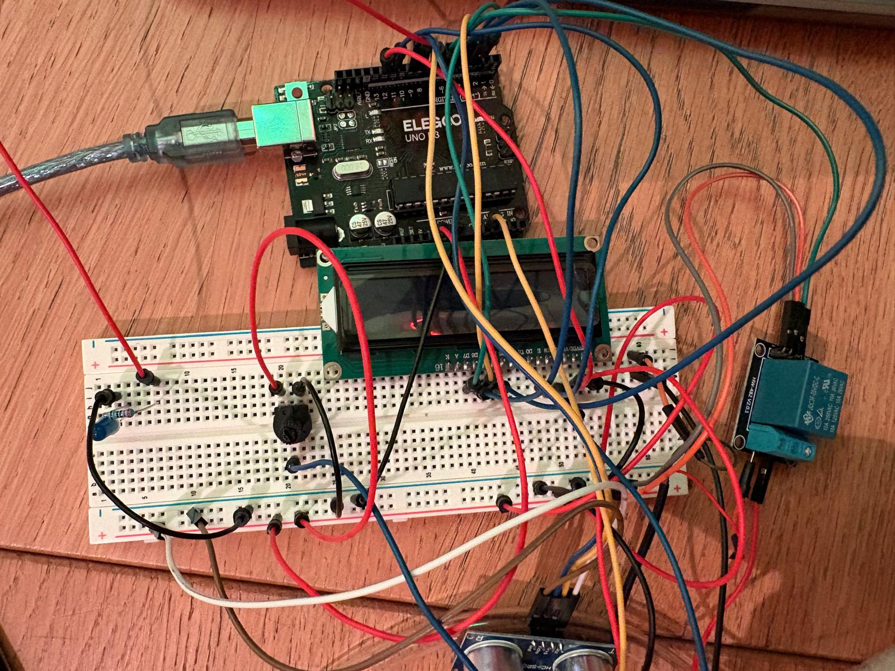

### 28.11.2025 
We started this session by testing the LCD display using the following tutorial: https://docs.arduino.cc/learn/electronics/lcd-displays/. 
After adjusting the wiring, the screen finally lit up and we modified our Arduino code so that it could actually display text.

Meanwhile, Frieda tested a Python code prototype (which we generated with help from Chat GPT) to verify that the interface worked and that the communication with Arduino ran without problems. 
When combining Python with Arduino, it is important to specify in the Python code which port the Arduino board is connected to.

We also brainstormed additional features. One idea was to integrate a small plant lexicon into the Python interface so users could look up common houseplants and their care requirements. 
Another idea was to display a graph showing how the plant connected to the Arduino system is doing over time.

At that point, our setup included the LCD display, which showed temperature, soil moisture, humidity, and whether the pump was running. 
However, the displayed sensor values were incorrect at first. After checking the wiring, we realized that the digital pin had not been connected properly to the sensor (https://projecthub.arduino.cc/rudraksh2008/temperature-and-humidity-sensor-with-arduino-1d52a6). 
Once we corrected this connection, the display showed accurate values.

Next, we added the ultrasonic distance sensor again and prepared the system with water to test the full setup. 
Unfortunately, during this test the pump stopped working even though the cables appeared to be connected correctly.

Currently, our setup looked like this:

### 30.11.2025 
During this meeting, Frieda began implementing the plant lexicon feature. 
She researched available datasets and found a predefined Excel sheet shared on Reddit - https://docs.google.com/spreadsheets/d/1RArYadwipMGp9QFCYqbUTmwvCPyvwURWf7hIABg2n14/edit?gid=0#gid=0. 
She converted this sheet into a CSV file so that it could be processed more easily in Python.

Afterwards, she integrated the data into the graphical user interface (GUI) of the plant watering system. 
She reused concepts from previous coursework, such as scrollbars and buttons, and reorganized the code by introducing classes and using tkinter to create a simple and visually consistent interface. 
However, the lexicon window currently has a problem where the screen width and height do not match the required content size, so we are still looking for a solution.

At the same time, Paula completed the Arduino-based watering system. 
She integrated all components so that they worked together. 
During initialization, the program sets up the serial monitor, LCD display, sensors, and outputs, and displays a welcome message. 
In the main loop, the system continuously reads data from the soil moisture sensor, the temperature and humidity sensor, and the ultrasonic sensor for the water tank level. 
If the DHT sensor fails, the program displays an error message and skips the watering cycle.
For this she used multiple sources: https://docs.arduino.cc/learn/electronics/lcd-displays/, https://projecthub.arduino.cc/lc_lab/automatic-watering-system-for-my-plants-e4c4b9, https://www.youtube.com/watch?v=w8Gyti0fwqI

The water tank level is monitored by the ultrasonic sensor, which activates an LED if the water level becomes too low. 
Based on the soil moisture value, the system compares the reading with a predefined threshold to decide whether watering is necessary. 
If watering is required, the relay activates the pump for five seconds, after which the system waits thirty seconds before continuing. 
All sensor data and system states are displayed on the LCD and logged to the serial monitor for debugging. 
Helper functions convert raw sensor values into percentages and calculate water distances from the ultrasonic sensor readings.

### 01.12.2025
We attempted to 3D print a container for our project in the Digital Lab. 
However, after seeing the estimated printing time, we decided not to proceed with printing the model there.
In the meantime we started creating our intermediate presentation. 
- 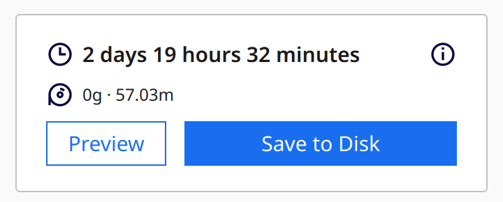
- 
- 

### 05.12.2025
Frieda modified the show_graphs function so that it reads data from plant_data.json in order to test whether actual data can be displayed in graph form. 
We are still unsure whether we will keep this approach or experiment further with Matplotlib.

We also discussed adding a combined graph that summarizes several environmental factors and possibly provides interpretations of what the data indicates about plant health. 
This could potentially be achieved by comparing the recorded data with the information from the plant lexicon.

### 07.12.2025
At first, we believed we would not be able to print the 3D container. 
However, Paula’s friend, who studies at TUHH, offered access to their 3D printing facilities. 
With the friend’s experience in 3D printing, Paula was able to optimize her model. 
As a result, the container could be printed more efficiently and with lower costs, using a filament thickness of 5%.

### 14.12.2025 
Because the walls of the printed container were slightly too thin, Paula decided to fill the inside of the water container with epoxy resin to make it waterproof and more stable.
Frieda continuously worked on the Python code and improved it before our presentation. 

### 16.12.2025
On this day we presented our project idea and current progress. After receiving feedback, we summarized several important points for improvement. 
We were advised not to add too many new features but instead focus on iterating and stabilizing the existing system.

We were also told to check potential wiring issues and improve the stability of the setup.
Additionally, we discussed categorizing plants into groups, such as tropical plants, so that watering behavior could be adjusted accordingly.
Yet, after proposing more ideas or asking for further input we were told that are project already combines a lot.

### 19.12.2025
Frieda explored the possibility of generating a plant health report within the interface. 
The idea was that users could select a plant, and the program would compare the plant’s weekly sensor data with the recommended environmental values stored in the lexicon.

However, the lexicon currently contains mostly descriptive text, while Python would require numerical values or ranges to perform comparisons. 
Therefore, we considered either modifying the lexicon itself or creating an additional file containing numerical ranges for ideal humidity and temperature values.

We decided to create an Excel sheet which we will then turn into a CSV file containing only numbers, which makes it easier for Python to read and later to compare the values. 
We divided the plants and each of us started researching optimal plant health.

### 19.02.2026
After creating an additional CSV file containing the minimum and maximum values for humidity and temperature, Frieda used this data to implement the health report feature. 
The CSV file was integrated into the Python program so that weekly sensor data could be compared with the recommended values.

The implementation required several attempts because some of the recorded weekly data did not initially match the comparison logic. 
After debugging and adjusting the code, the system finally generated a short health report that correctly corresponds to the values stored in the CSV file.

In the future, we could further improve the interface and presentation of the health report and potentially add more aspects to make the feedback more detailed.

### 02.03.2026
Today, Frieda further updated the designs in plant watering system.py. 
The interface still had some parts (for instance the graphs) that didn't align with the color scheme. 

### 05.03.2026
Today, Frieda once again put up the whole project to ensure it all still works accordingly. 
Unfortunately there were a few small issues but these could be solved. First, there was an error message: Serial error: table readings has 5 columns but 4 values were supplied. 
But there wasn't an exact location where this problem could be found. So she used ChatGPT and figured out that the plant_data.db had to be deleted and the code manually created a new one. 
After that there were no similar errors detected. 
Furthermore, she realised that the numbers we had once calibrated for wet and dry soil didn't work after all so after changing the Arduino IDE code accordingly everything worked. 

### 06.03.2026
Today, we realized that we hadn't yet incorporated the buzzer yet, because it was pretty loud when we worked with it. 
So Frieda had to add it into our 3D-container and connect it accordingly. This was a bit difficult because there are so many wires in our box. 
After a while she was able to insert it into the compartment which we had created for it. 

Then she had to adjust the Arduino code once again yet this wasn't too difficult as we had once prepared a code which already had a part of the Pirates of the Caribbean music inserted.
She went on and finalized all ideas for the final video. 

### 09.03.2026
Today, Frieda decided to further split the Python code into multiple Python files as the initial file: plant watering system had gotten a bit long. 
Other than that she finished editing the demo video. 

### 12.03.2026
Today, we finalized the design in plant_health.py which had initially caused problems because we initially used ttk.Combobox and couldn't match our discussed design anymore.
Furthermore, we added the final file structure and a general "How it works" to our README.  

## division of our work: 
Since this was a group project between two people, we divided the tasks between us. 
Because Paula would leave earlier in the semester, we decided from the beginning that we needed to start working early on the project. 
It was also clear that Frieda would likely have a slightly larger workload toward the end of the project. 
After discussing this with Qianxun Chen, it was agreed that Frieda could complete the final project video independently.

At the beginning of the project, our tasks often overlapped. 
We met weekly to discuss our progress, update each other on what we had accomplished, and worked side by side on different parts of the project. 
This collaboration proved to be very helpful, as someone who had been focusing on a different aspect of the project could often contribute useful ideas or suggestions.

Both of us participated in the hardware assembly. 
However, Paula mainly focused on the hardware components, their assembly and the soldering of parts, while Frieda supported where possible and contributed ideas for additional features that could be implemented.

The Arduino code was written collaboratively during several of our meetings, as this part required close coordination between hardware and software.

As the project progressed, Paula continued to focus more on the hardware and the Arduino Uno, while Frieda began developing the Python interface. 
Since we already had some experience from a previous project, we decided to keep a similar color scheme because we found it suitable and familiar.

Whenever problems occurred or new ideas emerged, Paula also contributed to the development of the Python interface. 
While Frieda added additional features such as the plant lexicon and the data visualization graphs, Paula focused on researching and designing a suitable 3D-printed container.

In addition, we both researched suitable plant health ranges for different plant species. 
Frieda was responsible for implementing these ranges into the Python interface so that the system could compare the measured values with the recommended conditions.

The documentation was written collaboratively at the end of each meeting. 
Towards the end of the project, Frieda revised the documentation to improve readability and added further information. 
In addition, she created and edited the final project video independently.

## sources/ references: 
sources see "Meetings"

sources presented in our intermediate presentation: 
- https://projecthub.arduino.cc/rudraksh2008/temperature-and-humidity-sensor-with-arduino-1d52a6
- https://projecthub.arduino.cc/ksoderby/smart-plant-watering-with-arduino-iot-cloud-0dff1f
- https://docs.arduino.cc/libraries/liquidcrystal/
- https://randomnerdtutorials.com/complete-guide-for-dht11dht22-humidity-and-temperature-sensor-with-arduino/#:~:text=Wrapping%20Up,()%20and%20readHumidity()%20methods.
- https://docs.python.org/3/library/tkinter.html
- https://docs.python.org/3/library/sqlite3.html
- https://docs.python.org/3.12/library/threading.html
- https://docs.python.org/3/library/queue.html
- https://pandas.pydata.org
- https://docs.python.org/3/library/json.html
- https://docs.python.org/3/library/os.html
- https://docs.python.org/3/library/datetime.html
- https://pypi.org/project/matplotlib/
- https://projecthub.arduino.cc/ansh2919/serial-communication-between-python-and-arduino-663756

for plant_health_ranges.csv:
- https://houseplantsnook.com/ultimate-parlor-palm-care-guide#:~:text=Clean%20and%20consistent%20root%20environment,t%20a%20long%2Dterm%20fix.
- https://www.patchplants.com/pages/plant-care/complete-guide-to-parlour-palm-care/
- https://plnts.com/en/care/houseplants-family/aglaonema
- https://www.plantvine.com/2024/05/13/maranta-prayer-plant-care-guide/#:~:text=Maintaining%20the%20right%20temperature%20and,or%20using%20a%20room%20humidifier.
- https://plnts.com/en/care/houseplants-family/calathea
- https://soltech.com/blogs/blog/spider-plant-growing-guide#:~:text=Temperature%20and%20Humidity&text=Ideally%2C%20they%20prosper%20in%20average,lush%20growth%20and%20vibrant%20foliage.
- https://soltech.com/products/stromanthe-triostar-care#:~:text=raise%20humidity%20levels.-,Temperature,Fahrenheit%20(15%20degrees%20Celsius).
- https://soltech.com/products/snake-plant-care#:~:text=Temperature,any%20potential%20temperature%2Drelated%20stress.
- https://mygreenscape.ca/pages/dracaena-plant-care#:~:text=Dracaena%20plants%20thrive%20in%20temperatures,drafts%20and%20sudden%20temperature%20changes.
- https://plnts.com/en/care/houseplants-family/zamioculcas
- https://plnts.com/en/care/houseplants-family/peperomia
- https://soltech.com/products/fiddle-leaf-fig-care#:~:text=Temperature,addition%20to%20any%20indoor%20space.
- https://easyplant.com/care/monstera-deliciosa
- https://plnts.com/en/care/houseplants-family/fittonia
- https://www.thesill.com/blogs/plants-101/how-to-care-for-golden-pothos-epipremnum-aureum
- https://www.rootskcmo.com/product/rhoeo-tricolor/1390#
- https://growhub.ae/blogs/blog/humidity-hacks-how-to-keep-your-peace-lily-thriving-in-dry-summer-air#:~:text=Ideal%20Humidity%20Range%20for%20Peace,so%20you%20can%20respond%20effectively.
- https://deepgreenpermaculture.com/2025/08/09/the-comprehensive-guide-to-caring-for-dumb-cane-dieffenbachia/#:~:text=Temperature%20and%20Humidity:%20Dieffenbachia%20prefers,especially%20in%20dry%20indoor%20climates.; https://www.almanac.com/plant/how-care-dieffenbachia-plants#:~:text=the%20fertilizer%20packaging.-,Humidity,pebble%20tray%20to%20raise%20humidity!
- https://www.bradyswest.com/philodendron#:~:text=Although%20the%20more%20humidity%20the%20better%2C%20a,of%2065%2D85%20degrees%20F%20(18%2D30%20degrees%20C).
- https://newnorthgreenhouses.ca/blogs/gardening-tips/lush-and-lovely-caring-for-boston-ferns-in-spring-and-summer#:~:text=Humidity%20and%20Temperature:%20Boston%20ferns,the%20risk%20of%20fungal%20infections.
- https://www.urbanplant.in/a/blog/post/how-to-grow-and-care-for-rubber-plants-at-home-the-ultimate-indoor-guide#:~:text=Ideal%20Range:,Humidity:%2040–60%25
- https://growtropicals.com/blogs/plant-care-a-z/pilea#:~:text=What%20temperature%20and%20humidity%20do,levels%20between%2040–60%25.&text=Avoid%20cold%20drafts%20(like%20near,to%20curl%20or%20drop%20prematurely.
- https://chaletboutique.com.au/blogs/plant-care/tradescantia-care-guide#:~:text=WHAT%20IS%20THE%20BEST%20HUMIDITY,which%20is%20average%20room%20humidity.
- https://www.thesill.com/blogs/plants-101/how-to-care-for-a-zebra-plant#:~:text=Humidity,to%20dry%20out%20or%20wilt.
- https://plantsome.ca/blogs/blog/how-to-care-for-alocasia-indoors#:~:text=Alocasia%20plants%20hail%20from%20tropical,Soil%20and%20Fertilization
- https://greg.app/string-of-pearls-indoor-care/#:~:text=String%20of%20Pearls%20thrive%20in%20low%20to%20moderate%20humidity%2C%20ideally,it%20remains%20healthy%20and%20vibrant.
- https://soltech.com/products/string-of-hearts-care
- https://www.thesill.com/blogs/plants-101/how-to-care-for-bird-of-paradise
- https://greg.app/hoya-sunrise-temperature/#:~:text=🌡%EF%B8%8F%20Home%20Sweet%20Home:%20Creating,coffee%20shop's%20reliable%20Wi%2DFi.

## AI usage: 
At the beginning of the project, we used ChatGPT to get initial ideas for how the Python application could be structured and what components would be necessary (e.g., dashboard, history, graphs).
For debugging purposes, we pasted error messages of Arduino IDE or Python into ChatGPT to better understand their causes and explore possible solutions. 
Additionally, we used AI to improve our documentation and refining the wording of explanations for clarity and precision. 
When implementing the CSV files, especially the plant_health_ranges because it couldn't read the file properly due to too many ; and a different layout we asked ChatGPT what the solution would be. After manually changing the file accordingly, everything could be read correctly. 
Additionally, we used AI in cases of design: For instance for the def show_history(self): we weren't sure how to change the colors of the headings and how to change the font from black to brown - so this is where we then inserted the code for the style.configure and added the table.tag_configure. 
We did the same for the def draw_graph(tab, y_values, ylabel, title): function to ensure that the graph would be according to the color scheme we had picked out. Additionally, it helped us improve the plant_health.py search bar and search result design so that it matched the overall design. 
Pasting the current code and describing what we actually wanted it to look like gave us helpful ideas.
Regarding Arduino IDE at the beginning we had troubles with the moisture, humidity and temperature reading - as our program showed the soil was dry - although it wasn't. We had to calibrate this accordingly and ChatGPT helped - we inserted the real numbers of wet, not wet and so on and then the numbers aligned. 
We also used ChatGPT to help refactor the Python project by dividing the code into meaningful modules, improving organization and readability so it’s not just one long file.

## Next steps and takeaways: 
- Since our plant lexicon does not currently include every possible plant, it could be expanded in future development stages by adding more plant species and their specific care requirements.
- Additionally, the graphs used to visualize the plant data could be further improved, and the user interface could be extended with additional features and functionalities to enhance usability and provide more detailed insights.
- In our project, we used the battery provided with the Arduino kit because we had already spent a certain amount of money on other components. Although we learned that a battery is generally not the most reliable long-term power source, it worked sufficiently for our setup. For longer-term or more stable usage, however, a different power supply could be implemented.

- Generally speaking we found this class and the work on our project very interesting, because we were able to combine hardware components with two different software environments. 
- We were also able to learn the basics of electronics, including wiring, understanding power supply issues and even soldering fragile cables to make components work reliably. 
- Furthermore, working with real sensor data taught us that values are often inconsistent. Debugging wrong readings, unstable connections, or incorrect sensor placement became a big part of our process. 
- Lastly, we learned how important documentation, testing and iteration are. Keeping track of what worked and what didn't helped us improve the system step by step. 